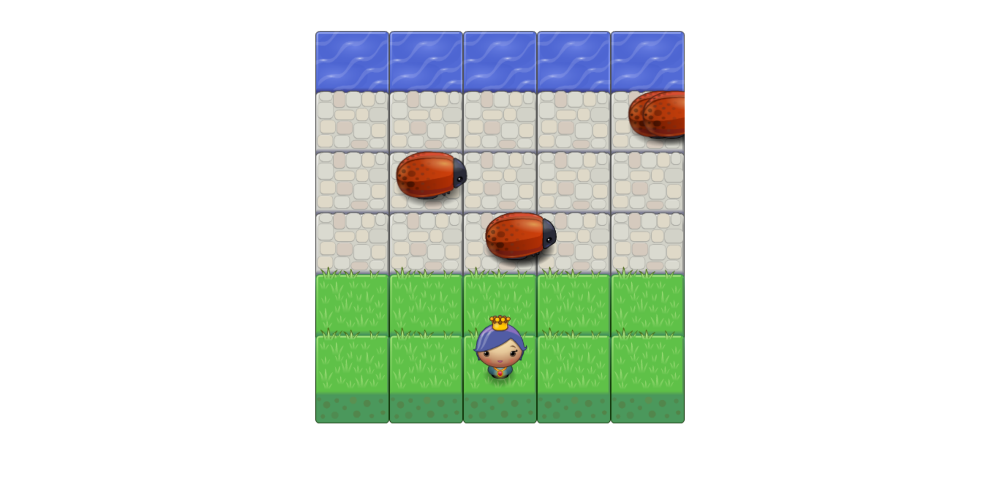

# Udacity Project 3 - Classic Arcade Game
These are the files for the third project in Udacity's Front End Web Development Nanodegree.  All of the code was written by me (Jonathan Sexton) unless otherwise stated.

The live, playable game can be found [here](https://js-goose.github.io/frontend-nanodegree-arcade-game/).

# Project Design
I wanted to customize the game, but I feel I am too far behind in the course work to spend anymore time on this project.  I will go back and add more features when time allows.

# Playing Locally
Fork a copy of the repo and then download the files to your local machine.  Once you have the files, simply open the folder and then open index.html in your favorite browser to start playing.

# Instructions
When the game loads, use your arrow keys (left, right, up, down) to move the character.  Avoid bugs to make it to the water and win the game.  If you get hit by a bug you'll have to start over.  Once the game is won a modal will pop up asking if you want to play again.

# Required Dependencies 
* None - The game will run locally once you have forked and cloned the repo or by using the above link to get a live playable version

# Optional Dependencies 
* None

# Pull Requests
I am the only contributor to this code (besdies the credited source of Udacity for the starter code) and the project is complete (pending a Udacity review).  Therefore I will not be accpeting pull requests.

# Licensing 
This project is subject to the license set forth by Udacity.  I am not 100% sure of the exact license.  If you wish to use their starter code you may do so [here](https://github.com/udacity/frontend-nanodegree-arcade-game) or [contact](https://www.udacity.com/contact) Udacity to enquire as to the specific license.